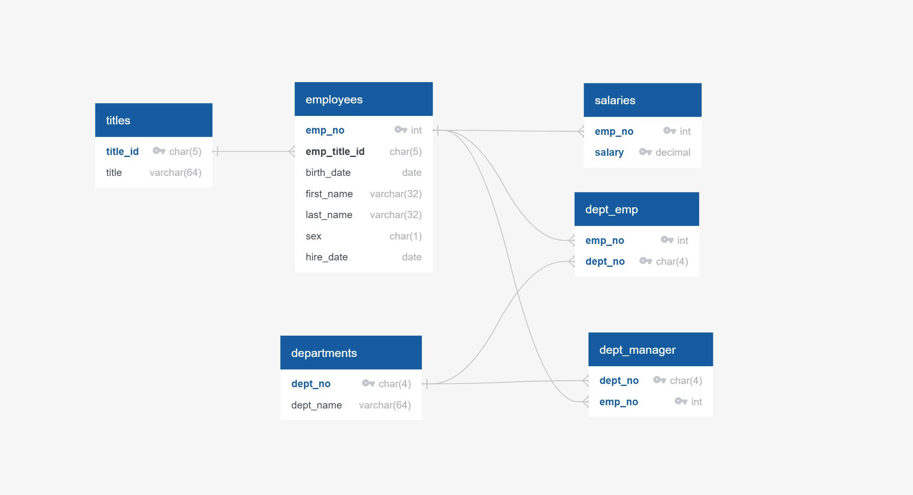
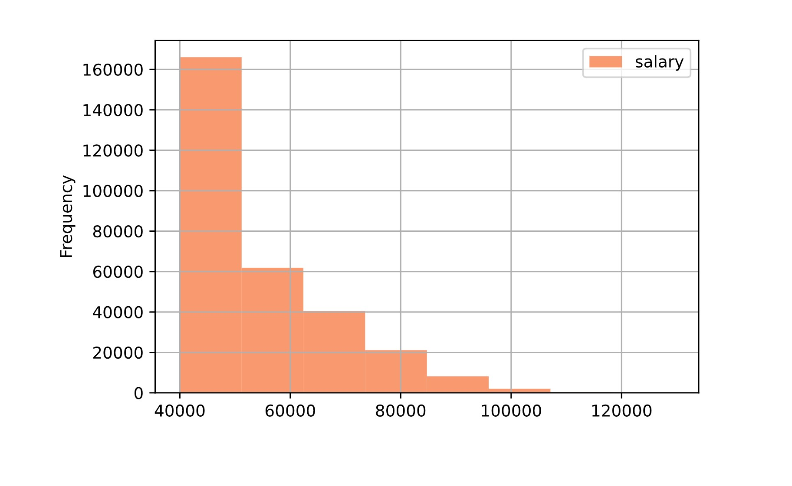
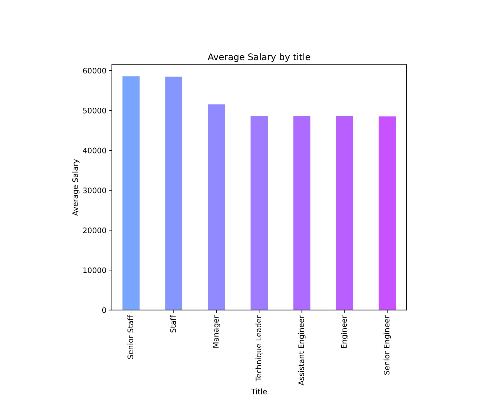

# sql-challenge

## Project Description 
Research on employees of Pewlett Hackard from the 1980s and 1990s from the data of employees from that period stored in six CSV files.
The goal was to design the tables to hold data in the CSVs, import the CSVs into a SQL database, and answer questions about the data.

#### Execution :

#### 1. Data Modeling
* Inspected the CSVs and sketched out an ERD of the tables. 
  * ERD [ERD.jpg](EmployeeSQL/Images/ERD.jpg) is saved in the folder [EmployeeSQL/Images/](EmployeeSQL/Images/)

#### 2. Data Engineering

* Using the information, created a table schema for each of the six CSV files with correct data types, primary keys, foreign keys, and other constraints.
* SQl file [Employee_Info_schema.sql](EmployeeSQL/SQL_Files/Employee_Info_schema.sql) contains table schema

  * Created primary keys to check to see if the column is unique, and composite keys (where required) to uniquely identify a row.
    * Composite keys used in 'salaries', 'dept_emp', 'dept_manager' tables.
    
  * Made sure to create tables in the correct order to handle foreign keys.

* Imported each CSV file into the corresponding SQL table. Made sure to import the data in the same order that the tables were created and account for the headers when importing to avoid errors.

#### 3. Data Analysis
* SQl file [Employee_Info_queries.sql](EmployeeSQL/SQL_Files/Employee_Info_queries.sql) contains queries required for analysis/reports

* Once complete database was created, wrote queries to generate the following:

1. List the following details of each employee: employee number, last name, first name, sex, and salary.

2. List first name, last name, and hire date for employees who were hired in 1986.

3. List the manager of each department with the following information: department number, department name, the manager's employee number, last name, first name.

4. List the department of each employee with the following information: employee number, last name, first name, and department name.

5. List first name, last name, and sex for employees whose first name is "Hercules" and last names begin with "B."

6. List all employees in the Sales department, including their employee number, last name, first name, and department name.

7. List all employees in the Sales and Development departments, including their employee number, last name, first name, and department name.

8. In descending order, list the frequency count of employee last names, i.e., how many employees share each last name.

#### Visualization of the data:
* Jupyter Notebook [bonus_analysis.ipynb](EmployeeSQL/bonus_analysis.ipynb) contains the bonus analysis and visualization.

1. Imported the SQL database into Pandas using SQLAlchemy.

2. Used .gitignore to safeguard userid and password

2. Created a histogram to visualize the most common salary ranges for employees.

3. Created a bar chart of average salary by title.

#### Epilogue

The name of Employee with employee ID number 499942 is "April Foolsday".

